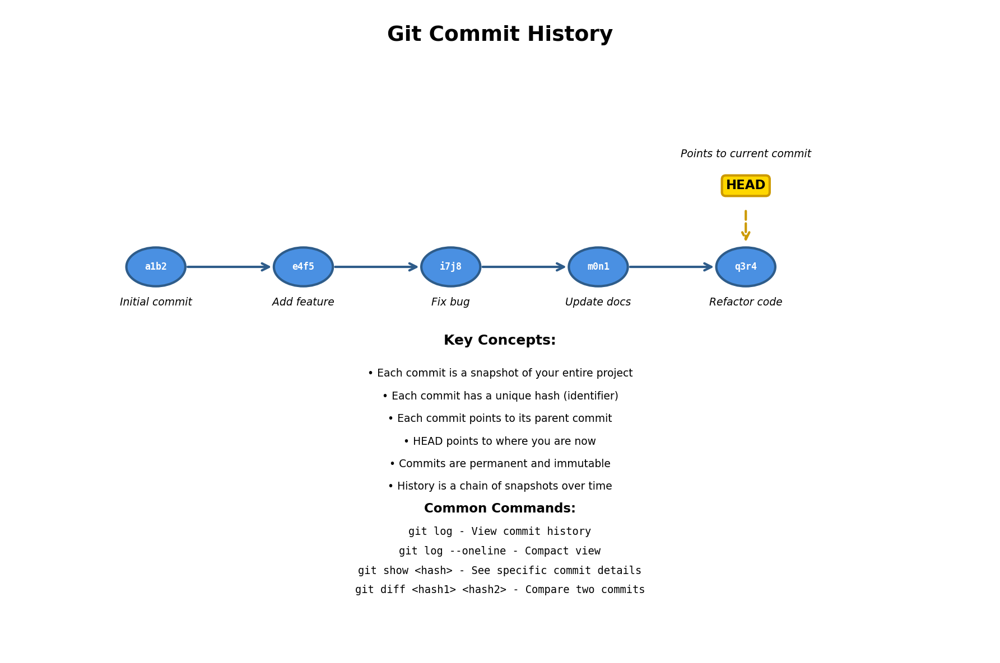
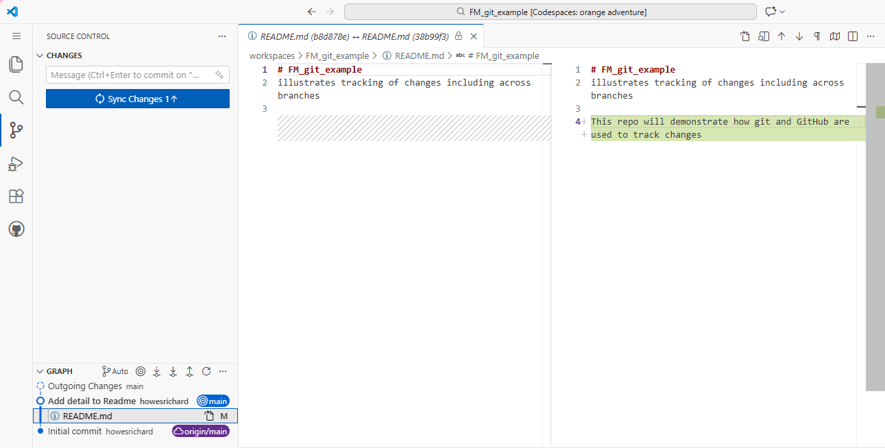
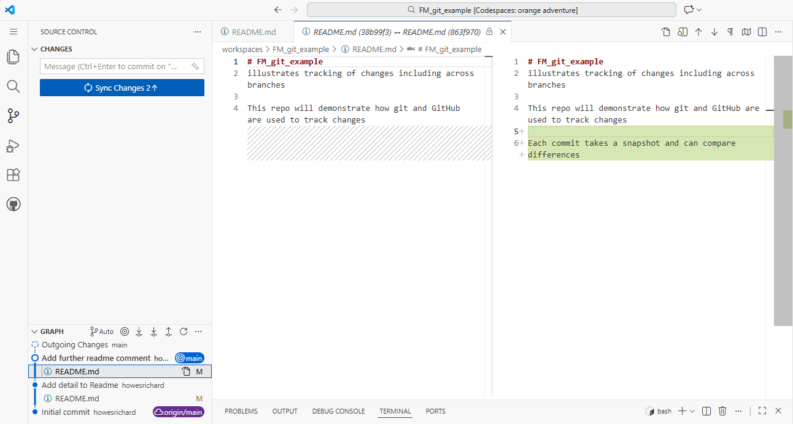
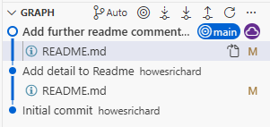
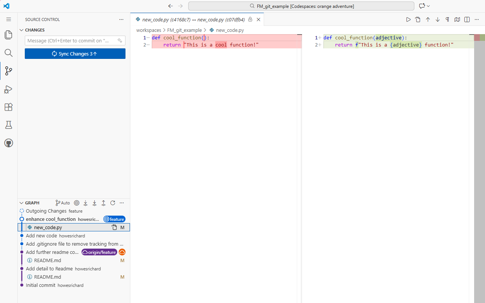
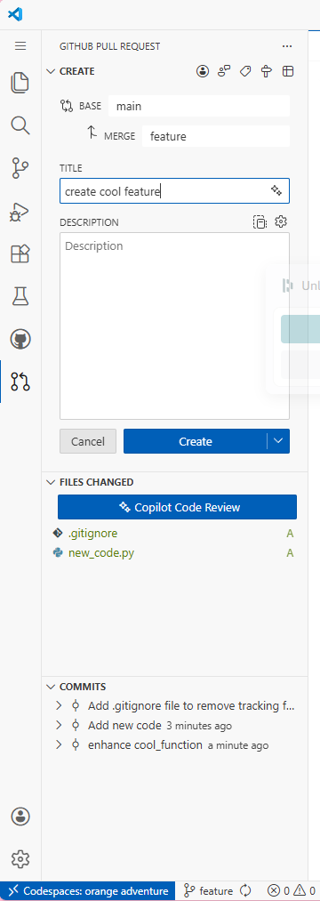
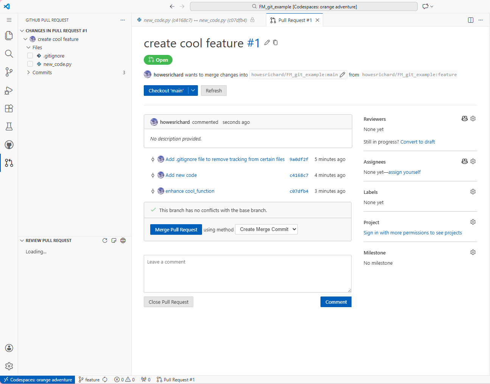
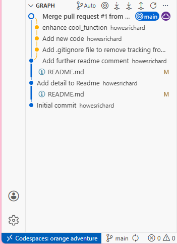
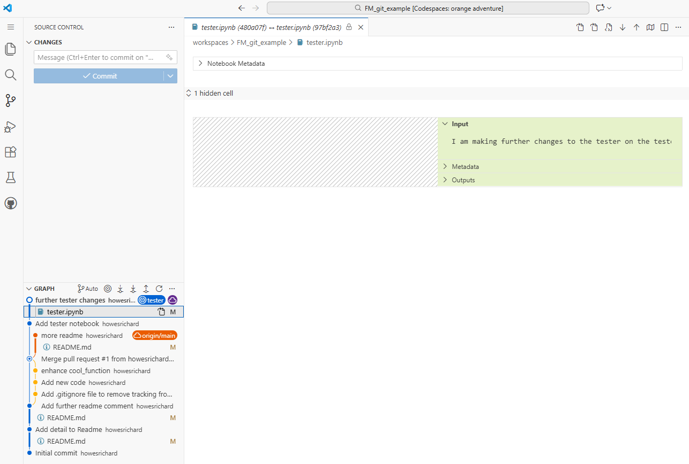
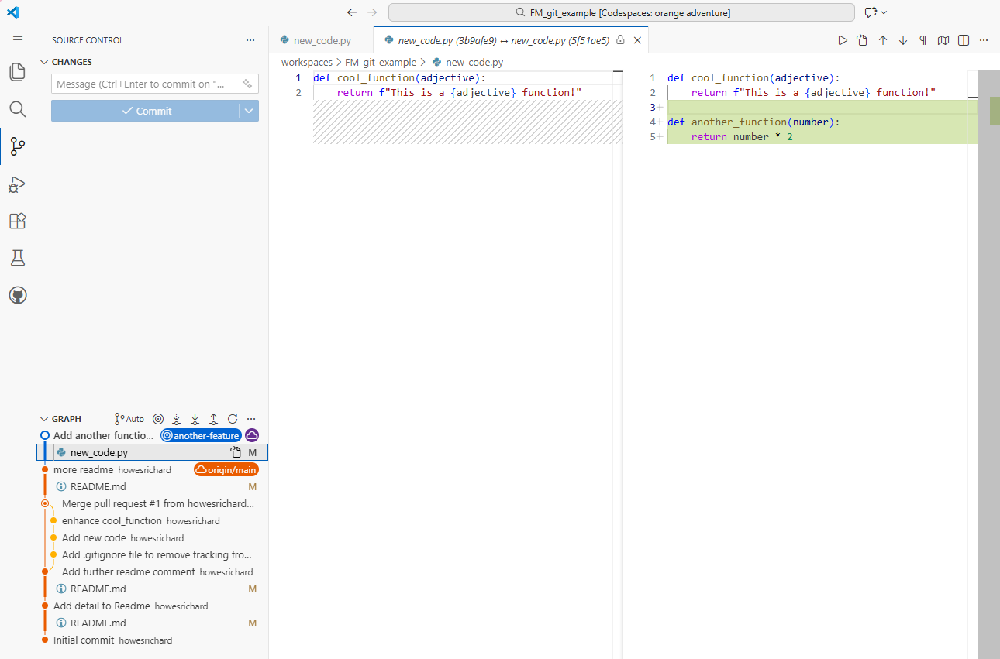

# A visual explanation of git and GitHub

## What is git
Git is a version controls system.   It tracks changes to files over time allowing you to:
- Save snapshots (commits) of your project at any point
- Compare commits to see what's changed
- Revert to previous versions if needed
- See who changed what and when
- Work on multiple features simultaneously (branches)
- Collaborate with others without overwriting each other's work

### Commits are a series of snapshots

## Screenshots of a illustrative workflow

Our initial commit contained only a redme file.   In our second commit we add a line to the readme.

In our third commit we add another line.   You can see the changes tracked between commits.   git diff is the command to bring this up.   Or you can click on the commit in the graph and the particular file you want to inspect changes on.

Now we use the git push command to publish this latest commit to the GitHub.

Now we create a new branch and call it "feature".

On this branch we create an new python file (we commit this as our 5th commit so far but this time to a new branch).   Then we enhance the function and commit this change to the feature branch. 

Now we create a Pull Request in order to merge our new feature into the main branch.

And then we merge it with a merge commit.

Now we switch back the the main branch.   Here you can see the history of our feature branch which is now merged.

Lets make another readme change.

Now we create a new branch "tester" to create a jupyter notebook to test the new function.

And yet another branch, "another-feature", to make another function within our .py file.

After we do a pull request for each of these and merge them in, you can see the parallel development displayed on the graph.

